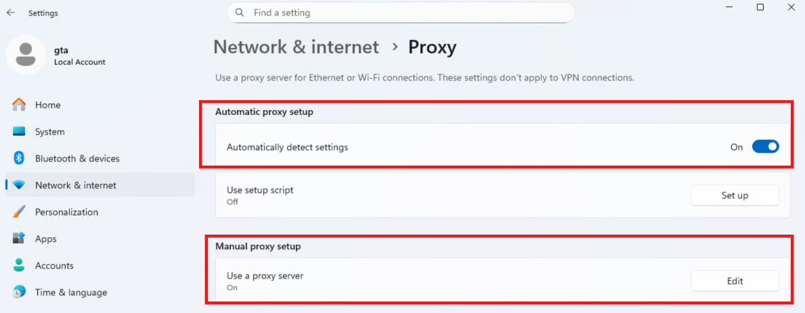
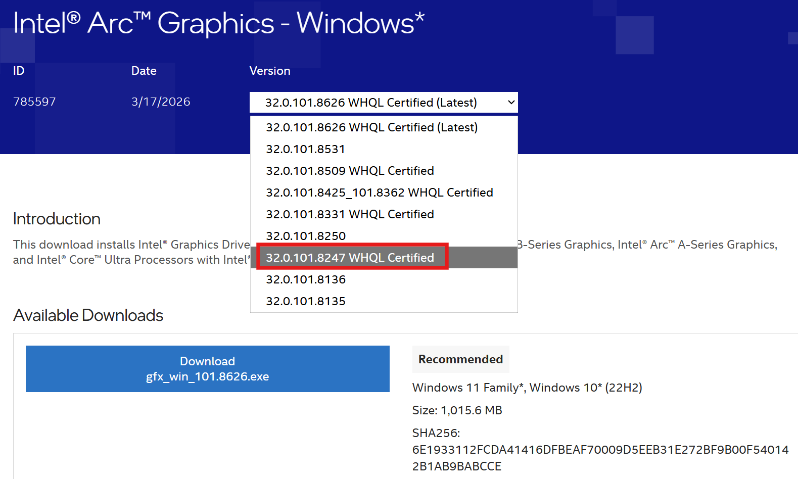
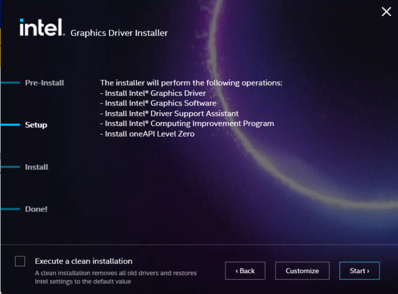
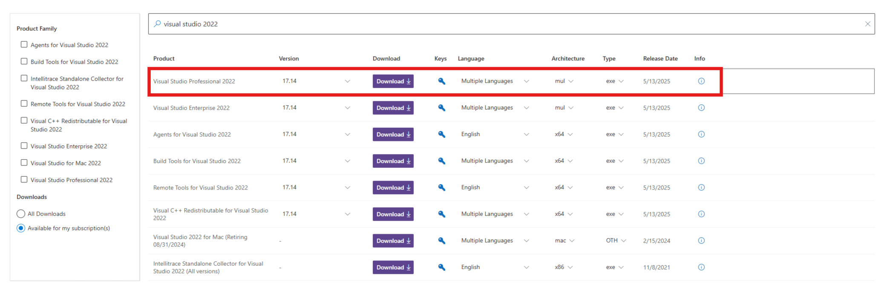
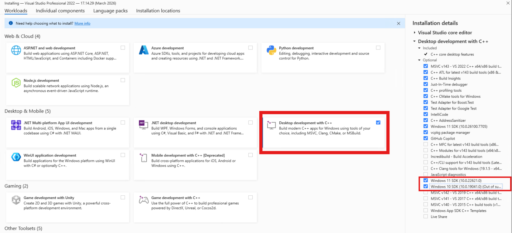

# Log

```log
[2026-03-22T12:55:52.151Z] os_version: Microsoft Windows 11 Pro
[2026-03-22T12:55:52.159Z] kernel_version: 10.0.26100
[2026-03-22T12:55:52.786Z] igpu_driver_version: NotDetected
[2026-03-22T12:55:52.786Z] [Pipeline] }
[2026-03-22T12:55:52.815Z] [Pipeline] echo
[2026-03-22T12:55:52.815Z] dgpu_driver_version: 32.0.101.8247
[2026-03-22T12:55:52.886Z] family_cpu: alderlake
[2026-03-22T12:55:53.054Z] dgpu: === Platform #0: Intel(R) OpenCL Graphics ===
[2026-03-22T12:55:53.054Z] -> Device #0:
[2026-03-22T12:55:53.054Z]   Device Name: Intel(R) Arc(TM) B580 Graphics
[2026-03-22T12:55:53.054Z]   Device Type: GPU
[2026-03-22T12:55:53.054Z]   Vendor: Intel(R) Corporation
[2026-03-22T12:55:53.054Z]   Device Version: OpenCL 3.0 NEO
[2026-03-22T12:55:53.054Z]   Driver Version: 32.0.101.8247
[2026-03-22T12:55:53.054Z]   OpenCL C Version: OpenCL C 1.2
[2026-03-22T12:55:53.054Z]   GPU Category: Discrete GPU (dGPU)
[2026-03-22T12:55:53.054Z]   Global Memory: 12508000256 bytes
[2026-03-22T12:55:53.054Z]   Local Memory: 131072 bytes
[2026-03-22T12:55:53.054Z]   Compute Units: 160
[2026-03-22T12:55:53.054Z]   Max Workgroup Size: 1024
[2026-03-22T12:55:53.054Z]   Clock Frequency: 2850 MHz
[2026-03-22T12:55:53.054Z]   Max Mem Alloc Size: 12508000256 bytes
[2026-03-22T12:55:53.054Z]   Image Support: Yes
[2026-03-22T12:55:53.063Z] dgpu: Intel(R) Arc(TM) B580 Graphics [0xE20B]
[2026-03-22T12:55:53.063Z] [Pipeline] }
[2026-03-22T12:55:53.195Z] [Pipeline] echo
[2026-03-22T12:55:53.196Z] gpu_details: name: Intel(R) Arc(TM) B580 Graphics
[2026-03-22T12:55:53.196Z] type: external
[2026-03-22T12:55:53.196Z] ram: 11.65 GB (12508000256 bytes)
[2026-03-22T12:55:53.278Z] cpu_model: 12thGenIntel(R)Core(TM)i9-12900K
```

# RIL

You can check the content from the following link and search the "Device ID", then will find that the BMG 580 dGPU device id is `0xE20B`:
https://www.intel.com/content/www/us/en/products/sku/241598/intel-arc-b580-graphics/specifications.html

- Device ID: `0xE20B`

```sql
'platform' LIKE 'Alder Lake' AND 'gfx_device_id' LIKE 'E20B'
```

## Windows

- Machine: [`DUT2198-BMGFRD`](https://gtax-ril-fm.intel.com/#/clients/4587)
- Image: `windows-AlderLake-B580-y26ww13.2.img.zst`


# Proxy
## Proxy on System
Proxy: `http://<proxy>:<port>`


## Proxy for Copilot Model

1. First don't set the proxy when login your github account on Vscode.
2. Click the right-bottom button to create agent chat, wait a moment.
3. You can't access the Claude model currently, then you need to set the proxy on your Vscode: `http://<proxy>:<port>`
4. After a moment or reload the Vscode, then you can see the Claude model.


# Set Machine Testing ON

```cmd
# Check if testsigning is Yes
bcdedit /enum

# Set testsigning on
bcdedit /set testsigning on
```
- `bcdedit` = Boot Configuration Data Editor, a built-in Windows tool used to modify boot configuration.
- `/set testsigning on` = turn on Test Signing Mode.

```cmd
# Reboot
shutdown /r /t 0
```
- `/r` means reboot.
- `/t 0` means execute after 0 seconds (reboot immediately).

```cmd
# Check if testsigning is Yes
bcdedit /enum
    Windows Boot Loader
    -------------------
    testsigning             Yes
```


# Windows Install GPU Driver

## GPU Device

Before installing GPU Driver:

```powershell
Get-PnpDevice -Class Display
    Status     Class           FriendlyName                       InstanceId
    ------     -----           ------------                       ----------
    OK         Display         Microsoft Basic Display Adapter    PCI\VEN_8086...
    OK         Display         Microsoft Remote Display Adapter   SWD\REMOTEDI...
    Error      Display         Microsoft Basic Display Adapter    PCI\VEN_8086...
    Unknown    Display         Microsoft Basic Display Adapter    PCI\VEN_1234...
```

## Install GPU Driver

Intel Official Website: https://www.intel.com/content/www/us/en/support/articles/000090440/graphics.html




Check GPU Driver Version:

```powershell
Get-WmiObject Win32_VideoController | Format-Table Name, DriverVersion
    Name                             DriverVersion
    ----                             -------------
    Intel(R) Arc(TM) B580 Graphics   32.0.101.8247
    Microsoft Remote Display Adapter 10.0.28000.1
    Microsoft Basic Display Adapter  10.0.28000.1
```

After installing GPU Driver:

```powershell
Get-PnpDevice -Class Display
    Status     Class           FriendlyName                       InstanceId
    ------     -----           ------------                       ----------
    OK         Display         Intel(R) Arc(TM) B580 Graphics     PCI\VEN_8086...
    OK         Display         Microsoft Remote Display Adapter   SWD\REMOTEDI...
    Error      Display         Microsoft Basic Display Adapter    PCI\VEN_8086...
    Unknown    Display         Microsoft Basic Display Adapter    PCI\VEN_1234...
```

# Install OpenVINO

Build index: https://ov-share-03.iotg.sclab.intel.com/openvino_ci/private_builds/dldt/master/commit

## Install from wheel

```bash
python --version
# Python 3.12.10

export no_proxy=.intel.com,iotg.sclab.intel.com,ov-share-03.iotg.sclab.intel.com
export NO_PROXY=.intel.com,iotg.sclab.intel.com,ov-share-03.iotg.sclab.intel.com

# (Reproduced) Install OpenVINO, Version: 2026.2.0-21396-a435286a495
pip install https://ov-share-03.iotg.sclab.intel.com/openvino_ci/private_builds/dldt/master/commit/a435286a495cefa712ad5169390a04296e281da0/private_windows_vs2022_release/wheels/openvino-2026.2.0.dev20260320-21396-cp312-cp312-win_amd64.whl \
  https://ov-share-03.iotg.sclab.intel.com/openvino_ci/private_builds/dldt/master/commit/a435286a495cefa712ad5169390a04296e281da0/private_windows_vs2022_release/wheels/openvino_tokenizers-2026.2.0.0.dev20260320-544-py3-none-win_amd64.whl

pip list | grep openvino
# openvino                      2026.2.0.dev20260320   21396
# openvino-telemetry            2025.2.0
# openvino-tokenizers           2026.2.0.0.dev20260320

python -c "import openvino as ov; print(ov.__version__)"
# 2026.2.0-21396-a435286a495

# Check
python -c "from openvino import Core; ie = Core(); print(ie.available_devices)"

# Uninstall
pip uninstall -y openvino openvino-telemetry openvino-tokenizers
```

Failed versions:

- **(Failed)** Version: `2026.2.0-21403-9a9b7d7ea00`

```bash
pip install https://ov-share-03.iotg.sclab.intel.com/openvino_ci/private_builds/dldt/master/commit/9a9b7d7ea005a8aa9b21f8c2cb13010e15e248d2/private_windows_vs2022_release/wheels/openvino-2026.2.0.dev20260323-21403-cp312-cp312-win_amd64.whl \
  https://ov-share-03.iotg.sclab.intel.com/openvino_ci/private_builds/dldt/master/commit/9a9b7d7ea005a8aa9b21f8c2cb13010e15e248d2/private_windows_vs2022_release/wheels/openvino_tokenizers-2026.2.0.0.dev20260323-544-py3-none-win_amd64.whl
```

- **(Failed)** Version: `2026.1.0-21352-f6221c2f44e`

```bash
pip install https://ov-share-03.iotg.sclab.intel.com/openvino_ci/private_builds/dldt/master/commit/f6221c2f44e9ecfa5ac1f039d0a29a05a13aef1c/private_windows_vs2022_release/wheels/openvino-2026.1.0.dev20260317-21352-cp312-cp312-win_amd64.whl \
  https://ov-share-03.iotg.sclab.intel.com/openvino_ci/private_builds/dldt/master/commit/f6221c2f44e9ecfa5ac1f039d0a29a05a13aef1c/private_windows_vs2022_release/wheels/openvino_tokenizers-2026.1.0.0.dev20260317-542-py3-none-win_amd64.whl
```

> After checking the ovvp history, this E2E test has failed in all Windows runs this year.
> https://ovvp.intel.com/e2e/degradation?md5id=ae39eb7470bd272d5d1b12e8c705926e

 

## Build From Source code

### Install Visual Studio
Reference: https://github.com/openvinotoolkit/openvino/blob/master/docs/dev/build_windows.md  
Release Note: https://learn.microsoft.com/en-us/visualstudio/releases/2022/release-notes?tabs=allfeatures  
Download Latest VS: https://visualstudio.microsoft.com/zh-hans/downloads/  
Download older version: https://visualstudio.microsoft.com/vs/older-downloads/  

`Visual Studio Professional 2022`:

Must be checked during installation:
  * Desktop development with C++
    * Windows 10 SDK
    * Windows 11 SDK




### Build Source Code
```bash
git clone https://github.com/openvinotoolkit/openvino.git
cd openvino

git submodule update --init --recursive
mkdir build && cd build
```

> **NOTE:** This is a hard restriction in OpenVINO's CMake — on Windows, `pyopenvino` (`.pyd`) cannot be built in Debug configuration because the debug Python library (`python312_d.lib`) is not part of the standard Python install. It must be built as Release or RelWithDebInfo.

#### Build OpenVINO CPP Code for Debug
Execute in **x64 Native Tools Command Prompt**:

```cmd
cd c:/Users/gta/Desktop/openvino/build

cmake -G "Visual Studio 17 2022" -A x64 ^
  -DCMAKE_BUILD_TYPE=Debug ^
  -DPYTHON_EXECUTABLE="C:/Python312/python" ^
  -DENABLE_INTEL_CPU=ON ^
  -DENABLE_INTEL_GPU=ON ^
  -DENABLE_INTEL_NPU=OFF ^
  -DENABLE_WHEEL=OFF ^
  -DENABLE_TESTS=ON ^
  -DENABLE_PYTHON=OFF ^
  -DENABLE_DEBUG_CAPS:BOOL=ON ^
  -DHTTP_PROXY=http://<proxy>:<port> ^
  -DHTTPS_PROXY=http://<proxy>:<port> ^
  ..

cmake --build . --config Debug -j12
```

#### Build OpenVINO Python Code for E2E test
Build `pyopenvino` in RelWithDebInfo:
```bash
ls '/c/Users/gta/Desktop/openvino/build/src/bindings/python/src/pyopenvino/pyopenvino.dir/Debug/pyopenvino.tlog'

cd C:\Users\gta\Desktop\openvino\build
cmake --build . --target pyopenvino --config RelWithDebInfo -- /maxcpucount:1
```

- Step 1: build every frontend (including the IR frontend, the TF frontend, etc.):
> Note: `/maxcpucount:4` is about 4x faster than the previous `:1`, and the `.pdb` write-collision risk for these targets is much lower than for `openvino_core_obj` (the latter was the main source of the earlier C1041 errors). If C1041 still occurs, drop to `:2`.
```bash
cmake --build . --target ov_frontends --config RelWithDebInfo -- /maxcpucount:4
```

- Step 2: build the GPU plugin (the test specifies `device_GPU`). Re-run this compile command when changed GPU plugin source code:
```bash
cmake --build . --target openvino_intel_gpu_plugin --config RelWithDebInfo -- /maxcpucount:4
```

- Step 3: build the plugin registry (which generates `plugins.xml`):
```bash
cmake --build . --target ov_plugins --config RelWithDebInfo -- /maxcpucount:4
```

Once that finishes, verify that these DLLs exist under RelWithDebInfo:
```powershell
Get-ChildItem "C:\Users\gta\Desktop\openvino\bin\intel64\RelWithDebInfo" -Filter "*.dll" | Where-Object {$_.Name -match "frontend|gpu|cpu"} | Select-Object Name

ls /c/Users/gta/Desktop/openvino/build/src/bindings/python/src/pyopenvino/pyopenvino.dir/
```

Set Environment Variables:

```CMD
# CMD
set PATH=C:\Users\gta\Desktop\openvino\bin\intel64\Debug;%PATH%
set PATH=C:\Users\gta\Desktop\openvino\temp\Windows_AMD64\tbb\bin;%PATH%
```

```powershell
# Powershell
$env:PATH = "C:\Users\gta\Desktop\openvino\bin\intel64\Debug;" + $env:PATH
$env:PATH = "C:\Users\gta\Desktop\openvino\temp\Windows_AMD64\tbb\bin;" + $env:PATH
```

```bash
# Git Bash
export PATH="/c/Users/gta/Desktop/openvino/bin/intel64/Debug:$PATH"
export PATH="/c/Users/gta/Desktop/openvino/temp/Windows_AMD64/tbb/bin:$PATH"
```

Verify:

```bash
python -c "import openvino as ov; print(ov.__version__)"
# 2026.2.0-21396-a435286a495

# Check
python -c "from openvino import Core; ie = Core(); print(ie.available_devices)"
```


# Install E2E test

```bash
# Try this in Git Bash
curl -x http://<proxy>:<port> -I https://github.com

git config --list --show-origin | grep -i proxy
# file:C:/Users/gta/.gitconfig    http.https://github.com.proxy=http://<proxy>/<port>
# file:C:/Users/gta/.gitconfig    http.https://lfs.github.com.proxy=http://<proxy>/<port>
# file:C:/Users/gta/.gitconfig    http.https://github-cloud.s3.amazonaws.com.proxy=http://<proxy>/<port>
# file:C:/Users/gta/.gitconfig    http.https://github-cloud.githubusercontent.com.proxy=http://<proxy>/<port>
# file:C:/Users/gta/.gitconfig    http.proxy=http://<proxy>:<port>
# file:C:/Users/gta/.gitconfig    https.proxy=http://<proxy>:<port>

git config --global --unset-all http.https://github.com.proxy
git config --global --unset-all http.https://lfs.github.com.proxy
git config --global --unset-all http.https://github-cloud.s3.amazonaws.com.proxy
git config --global --unset-all http.https://github-cloud.githubusercontent.com.proxy

git config --global http.proxy http://<proxy>:<port>
git config --global https.proxy http://<proxy>:<port>

git config --list --show-origin | grep -i proxy
# file:C:/Users/gta/.gitconfig    http.proxy=http://<proxy>:<port>
# file:C:/Users/gta/.gitconfig    https.proxy=http://<proxy>:<port>

GIT_CURL_VERBOSE=1 \
git clone https://github.com/intel-innersource/frameworks.ai.openvino.tests.git

# Create venv environment if not created before
cd frameworks.ai.openvino.tests/
python -m venv venv
source venv/Scripts/activate

# Install required python modules
# NOTE: If specific tensorflow version is not available, remove version string in requirements.txt
pip install -r requirements.txt
pip install -r e2e_oss/requirements.txt

pip install distro

# Download cvt file
# http://ov-share-02.iotg.sclab.intel.com/chunk-01/openvino_validation/models/internal/pytorch/huggingface/cvt/
cd frameworks.ai.openvino.tests
mkdir -p e2e_oss/models/internal/pytorch/huggingface/cvt/
cd e2e_oss/models/internal/pytorch/huggingface/cvt/
curl -o cvt.pt http://ov-share-02.iotg.sclab.intel.com/chunk-01/openvino_validation/models/internal/pytorch/huggingface/cvt/cvt.pt
```


# Download Model

Model index: http://ov-share-10.sclab.intel.com/volatile/ir/openvino/master

```bash
cd /c/Users/gta/Desktop/frameworks.ai.openvino.tests/e2e_oss/
mkdir -p models/TF_Separate_Bass_batch_1_device_CPU_precision_FP1673e2pln4
cd models/
curl -o irs_mapping.csv \
  http://ov-share-10.sclab.intel.com/volatile/ir/openvino/master/9a9b7d7ea005a8aa9b21f8c2cb13010e15e248d2/python_api_serialized/irs_mapping.csv
cd TF_Separate_Bass_batch_1_device_CPU_precision_FP1673e2pln4

curl -o TF_Separate_Bass_IR_v11_FP16_batch_1.bin \
  http://ov-share-10.sclab.intel.com/volatile/ir/openvino/master/9a9b7d7ea005a8aa9b21f8c2cb13010e15e248d2/python_api_serialized/TF_Separate_Bass_batch_1_device_CPU_precision_FP1673e2pln4/TF_Separate_Bass_IR_v11_FP16_batch_1.bin

curl -o TF_Separate_Bass_IR_v11_FP16_batch_1.xml \
  http://ov-share-10.sclab.intel.com/volatile/ir/openvino/master/9a9b7d7ea005a8aa9b21f8c2cb13010e15e248d2/python_api_serialized/TF_Separate_Bass_batch_1_device_CPU_precision_FP1673e2pln4/TF_Separate_Bass_IR_v11_FP16_batch_1.xml
```


# Download pb file

pb file index: https://ov-share-02.iotg.sclab.intel.com/chunk-01/openvino_validation/models/internal/tf/1.15.2/separate_bass/

```bash
mkdir -p /c/Users/gta/Desktop/frameworks.ai.openvino.tests/e2e_oss/models/internal/tf/1.15.2/separate_bass
cd /c/Users/gta/Desktop/frameworks.ai.openvino.tests/e2e_oss/models/internal/tf/1.15.2/separate_bass
curl -o saved_model.pb https://ov-share-02.iotg.sclab.intel.com/chunk-01/openvino_validation/models/internal/tf/1.15.2/separate_bass/saved_model.pb
curl -o separate_bass.readme https://ov-share-02.iotg.sclab.intel.com/chunk-01/openvino_validation/models/internal/tf/1.15.2/separate_bass/separate_bass.readme
```


# e2e test

Set environment variables:

```cmd
:: CMD
set PATH=C:\Users\gta\Desktop\openvino\bin\intel64\Debug;%PATH%
set PATH=C:\Users\gta\Desktop\openvino\temp\Windows_AMD64\tbb\bin;%PATH%
```

```powershell
# Powershell
$env:PATH = "C:\Users\gta\Desktop\openvino\bin\intel64\Debug;" + $env:PATH
$env:PATH = "C:\Users\gta\Desktop\openvino\temp\Windows_AMD64\tbb\bin;" + $env:PATH
```

```bash
# Git Bash: OpenVINO environment (RelWithDebInfo build)
# Use Windows path format (python.exe is a Windows binary and does not understand /c/), the PATH can stay in MSYS format (Git Bash converts it automatically)
export PYTHONPATH="C:/Users/gta/Desktop/openvino/bin/intel64/RelWithDebInfo/python;C:/Users/gta/Desktop/openvino/tools/ovc"
export OPENVINO_LIB_PATHS="C:/Users/gta/Desktop/openvino/bin/intel64/RelWithDebInfo;C:/Users/gta/Desktop/openvino/temp/Windows_AMD64/tbb/bin"
export PATH="/c/Users/gta/Desktop/openvino/bin/intel64/RelWithDebInfo:$PATH"
export PATH="/c/Users/gta/Desktop/openvino/temp/Windows_AMD64/tbb/bin:$PATH"

# verify
python -c "import openvino; print('openvino OK:', openvino.__version__)"

cd /c/Users/gta/Desktop/frameworks.ai.openvino.tests
source venv/Scripts/activate && cd e2e_oss
export E2E_PATH=/c/Users/gta/Desktop/frameworks.ai.openvino.tests/e2e_oss
export SHARE=$E2E_PATH

# Run the E2E test
python -m pytest test_ovc_mo.py \
    --tb=native \
    --env_conf=.automation/env_config.yml \
    --test_conf=.automation/test_configs/desktop_test_config_gpu_llm.yml \
    -m "not launch_only_if_manually_specified" \
    --pregen_irs=/c/Users/gta/Desktop/frameworks.ai.openvino.tests/e2e_oss/models/irs_mapping.csv \
    --tf_models_version=1.15.2 \
    --modules pipelines/production/tf/heavy \
    -k "TF_Separate_Bass_batch_1_device_GPU_precision_FP16" \
    --dynamism_type=None \
    --log-cli-level INFO
```

# Git log

```bash
git show 862169c866 -- src/plugins/intel_gpu/src/graph/impls/onednn/concatenation_onednn.hpp
    commit 862169c866708f23f632111f77ccd72e58bafcc8
    Author: hyunback kim <hyunback.kim@intel.com>
    Date:   Mon Mar 23 11:58:35 2026 +0900

        [GPU] Remove W.A for onednn concat validate_impl (#33273)

        Recently onednn concat accuracy problem has been fixed, now no need W.A
        code. Remove W.A onednn concat limitation for odd value in block format.

        This PR should be merged after the onednn fixed
        PR(https://github.com/uxlfoundation/oneDNN/pull/4440) is into openvino.

        Related W.A PR: https://github.com/openvinotoolkit/openvino/pull/32368

        ### Tickets:
        - *ticket-id*

        Signed-off-by: hyunback <hyunback.kim@intel.com>

    diff --git a/src/plugins/intel_gpu/src/graph/impls/onednn/concatenation_onednn.hpp b/src/plugins/intel_gpu/src/graph/impls/onednn/concatenation_onednn.hpp
    index d9eaf20477..f391b18b77 100644
    --- a/src/plugins/intel_gpu/src/graph/impls/onednn/concatenation_onednn.hpp
    +++ b/src/plugins/intel_gpu/src/graph/impls/onednn/concatenation_onednn.hpp
    @@ -84,10 +84,6 @@ struct ConcatenationImplementationManager : public ImplementationManager {
                return false;
            }
    
    -        const auto& concat_node = node.as<concatenation>();
    -        auto concat_axis = concat_node.get_primitive()->axis;
    -
    -        size_t index = 0;
            for (const auto& dep : node.get_dependencies()) {
                const auto& in_layout = dep.first->get_output_layout(false, dep.second);

    @@ -99,14 +95,6 @@ struct ConcatenationImplementationManager : public ImplementationManager {
    
                if (!one_of(in_layout.format.value, supported_in_fmts))
                    return false;
    -
    -            // WA: Onednn has an issue in simple_concat blocked format Odd value, will be fixed next release.
    -            if (index !=0 && concat_axis == 1 &&
    -                !format::is_simple_data_format(in_layout.format) &&
    -                in_layout.get_partial_shape()[1].is_static() &&
    -                in_layout.get_partial_shape()[1].get_length() % 2 != 0)
    -                return false;
    -            index++;
            }
    
            return true;
```

# Dump Graph

- Name: `Transpose_125953718`

```bash
# ============================================= Dump Graph ===============================================
DUMPPATH=dump_181149
mkdir -p ${DUMPPATH}/{graph,src,layer}

export OV_GPU_DUMP_SOURCES_PATH=${DUMPPATH}/src/
export OV_GPU_DUMP_GRAPHS_PATH=${DUMPPATH}/graph/
export E2E_PATH=frameworks.ai.openvino.tests/e2e_oss
export SHARE=$E2E_PATH

benchmark_app \
  -exec_graph_path ${DUMPPATH}/graph/001_gpu_execute.graph.xml \
  -m frameworks.ai.openvino.tests/e2e_oss/models/TF_Separate_Bass_batch_1_device_CPU_precision_FP1673e2pln4/TF_Separate_Bass_IR_v11_FP16_batch_1.xml \
  -nstreams 1 \
  -nireq 1 \
  -b 1 \
  -infer_precision f16 \
  -d GPU \
  -hint none \
  -inference_only=false \
  -data_shape "[100,2]" \
  -niter 1
```


