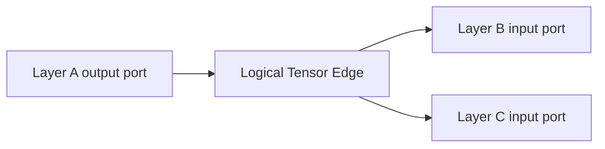

# How Data Is Transferred Between Layers in OpenVINO

This document is meant to be read alongside `samples/cpp/layer_data_flow_demo/layer_data_flow_demo.cpp`. The sole goal is to clearly explain how data actually flows between layers.

The short answer:

The old Inference Engine era `Blob` concept is NOT the core abstraction for inter-layer connections in modern OpenVINO.

More precisely, modern OpenVINO is divided into two levels:

1. Graph structure level: who connects to whom, described by `Output`, `Input`, and `descriptor::Tensor`.
2. Runtime level: the actual memory holding numerical values is `ov::ITensor` / `ov::Tensor`.

If you've read older materials before, think of `Blob` as simply "the old name for a data container". But when reading modern source code, focus on the `Tensor` path instead.

## 1. Relevant OpenVINO Source Code Paths

This demo primarily references the following source files, ordered from easiest to understand to most critical:

1. `src/core/include/openvino/core/node_output.hpp`
2. `src/core/include/openvino/core/node_input.hpp`
3. `src/core/include/openvino/core/descriptor/tensor.hpp`
4. `src/inference/src/dev/isync_infer_request.cpp`
5. `src/inference/src/model_reader.cpp`

What each one tells us:

1. `node_output.hpp`
   `Output<Node>` represents "a specific output port of a layer". Here you can see `get_tensor_ptr()`, indicating that an output port can retrieve its corresponding tensor descriptor object.

2. `node_input.hpp`
   `Input<Node>` represents "a specific input port of a layer". It also has `get_tensor_ptr()`, showing that input ports can likewise access the tensor descriptor object.

3. `descriptor/tensor.hpp`
   This defines `ov::descriptor::Tensor`. Note its comment: "Compile-time descriptor of a first-class value that is a tensor". In plain language: it's more like a "tensor specification in the graph" rather than the actual memory block holding data.

4. `isync_infer_request.cpp`
   This is crucial. The code follows this pattern:
   `m_tensors.at(get_inputs().at(found_port.idx).get_tensor_ptr()) = tensor;`

   What does this tell us?
   The inference request uses the "graph-level tensor descriptor pointer" as a key, then maps it to the "actual runtime tensor memory object".

5. `model_reader.cpp`
   Here you can see `inputs[i].get_tensor_ptr()` and `outputs[i].get_tensor_ptr()` being extracted for name management. This further proves that the graph structure level revolves around tensor descriptor objects.

## 2. The Simplest Mental Model

Think of an edge like this:



The key points of the diagram above:

1. `Layer A`'s output port produces a "logical tensor edge".
2. One or more downstream layers' input ports reference this edge.
3. Only at execution time is this "logical edge" bound to actual memory.

Therefore, the core mechanism of "data transfer between layers" is NOT "one layer stuffing a Blob into the next layer". Rather:

1. Port connections are established on the graph first.
2. Behind these connections, a shared tensor descriptor object exists.
3. At runtime, it is then mapped to a real memory object.

## 3. Looking at yolo26n.xml as an Example

The model file is:

`models/yolo/yolo26n_openvino_model/yolo26n.xml`

The first few edges look roughly like this:

1. `0:0 -> 3:0`
2. `2:0 -> 3:1`
3. `3:2 -> 5:0`
4. `4:0 -> 5:1`
5. `5:2 -> 6:0`

In plain language:

1. `layer 0` is the input `Parameter`; its output feeds into `layer 3`'s input 0.
2. `layer 2` is a convolution weight `Const`; its output feeds into `layer 3`'s input 1.
3. `layer 3` performs convolution; its output feeds into `layer 5`'s input 0.
4. `layer 4` is a bias constant; it feeds into `layer 5`'s input 1.
5. `layer 5` performs Add; its result is sent to `layer 6`.

This is the most basic pattern: "upstream output port -> an edge -> downstream input port".

## 4. Why Blob Is Not the Main Concept

Many beginners get confused because there are too many outdated articles online.

In the old Inference Engine era, you'd frequently see:

1. `Blob`
2. `CNNNetwork`
3. `InferRequest::SetBlob`

But in the modern OpenVINO source code, the core entry points have become:

1. `ov::Model`
2. `ov::Output`
3. `ov::Input`
4. `ov::descriptor::Tensor`
5. `ov::Tensor`

So the more accurate description is:

1. Graph connections rely on ports and tensor descriptors.
2. Runtime data is carried by tensor memory objects.
3. `Blob` is a historical concept and should not be your entry point for understanding modern source code.

## 5. What This Pure C++ Demo Does

Sample code location:

`samples/cpp/layer_data_flow_demo/layer_data_flow_demo.cpp`

It does 4 specific things:

1. Without using the OpenVINO API, it directly parses `<layer>` and `<edge>` elements from `yolo26n.xml`.
2. It builds a minimal graph structure: `LayerInfo`, `PortInfo`, `EdgeInfo`.
3. It implements its own `TensorBuffer` to simulate "a layer's output producing a block of data".
4. It executes the first few layers in topological order, printing "which input port received which tensor".

Note:

It does NOT perform real convolution computation.

This is intentional. The question here is not "how is convolution math implemented" but rather "how does data flow between layers". Piling in convolution, activation, broadcasting, and weight loading from the start would obscure the main point.

## 6. Key Parts of the Code

### 6.1 `IRXmlParser`

It reads from the XML:

1. layer id
2. layer name
3. layer type
4. input/output ports
5. edge connections

Think of it as "translating the OpenVINO IR into our own C++ structs".

### 6.2 `TensorBuffer`

This is the educational version of a "runtime data block".

It contains:

1. `logical_name`
2. `shape`
3. `preview_values`
4. `producer_layer`

It uses `std::shared_ptr<TensorBuffer>` for storage, for a simple reason:

If one layer's output is consumed by multiple downstream layers simultaneously, multiple places can share the same object reference. This closely mirrors the graph-level relationship where "multiple Inputs point to the same logical tensor".

### 6.3 `MiniGraphRuntime::execute_first_layers`

This function prints information like:

1. Which upstream layer a given layer's input port receives data from.
2. Which `tensor#N` it gets.
3. The object address of that `tensor#N`.

The object address serves a particularly intuitive purpose:

If the same output is consumed by multiple places, you'll see the same address referenced repeatedly. This immediately makes it clear: "Oh, it's not copying out a bunch of new objects — multiple ports are referencing the same logical data block."

## 7. How to Build and Run

Build first:

```bash
cmake -S . -B build -DCMAKE_BUILD_TYPE=Debug -DCMAKE_EXPORT_COMPILE_COMMANDS=ON -DOpenVINO_DIR=${config:openvino.buildDir}
cmake --build build --target layer_data_flow_demo -j
```

Then run:

```bash
./bin/samples/layer_data_flow_demo models/yolo/yolo26n_openvino_model/yolo26n.xml 6
```

The `6` at the end means:

Only simulate the first 6 computable layers, to avoid printing the entire YOLO graph which would be too much information to read clearly.

## 8. Mapping Between OpenVINO Source Code and This Demo

### Graph-Level Layer Connections in OpenVINO

Focus on:

1. `src/core/include/openvino/core/node_output.hpp`
2. `src/core/include/openvino/core/node_input.hpp`

These two files tell you:

1. Output ports can access a tensor.
2. Input ports can also access a tensor.
3. Therefore, the connection between layers is not "just nodes with nothing in between" but rather a combination of "ports + tensor descriptors".

### Runtime Memory Binding in OpenVINO

Focus on:

1. `src/inference/src/dev/isync_infer_request.cpp`

The core understanding in one sentence:

The graph first establishes "which tensor descriptor corresponds to which port", and then the inference request uses that descriptor to find the actual memory object.

### Correspondence with the Demo

1. OpenVINO `Output/Input` corresponds to `EdgeInfo + PortInfo` in the demo.
2. OpenVINO `descriptor::Tensor` corresponds to the "logical tensor concept" in the demo.
3. OpenVINO `ov::Tensor / ITensor` corresponds to `TensorBuffer` in the demo.

Of course, this correspondence is for educational purposes only — it's not a 1:1 reproduction of the full internal implementation.

## 9. Final Memory Aid for Beginners

Just remember these three statements:

1. Data is not passed directly hand-to-hand between `Layer` and `Layer` — there are `port` and `tensor edge` in between.
2. When reading modern OpenVINO source code, prioritize understanding `Tensor` first — don't get sidetracked by old `Blob` materials.
3. At the graph level it's "logical tensor descriptors"; at runtime it's "real memory data blocks".

If you want to go further, the recommended reading order is:

1. Start with `node_output.hpp` and `node_input.hpp`.
2. Then read `descriptor/tensor.hpp`.
3. Finally look at how tensors are mapped to memory objects in `isync_infer_request.cpp`.

This order is the least likely to cause confusion.
